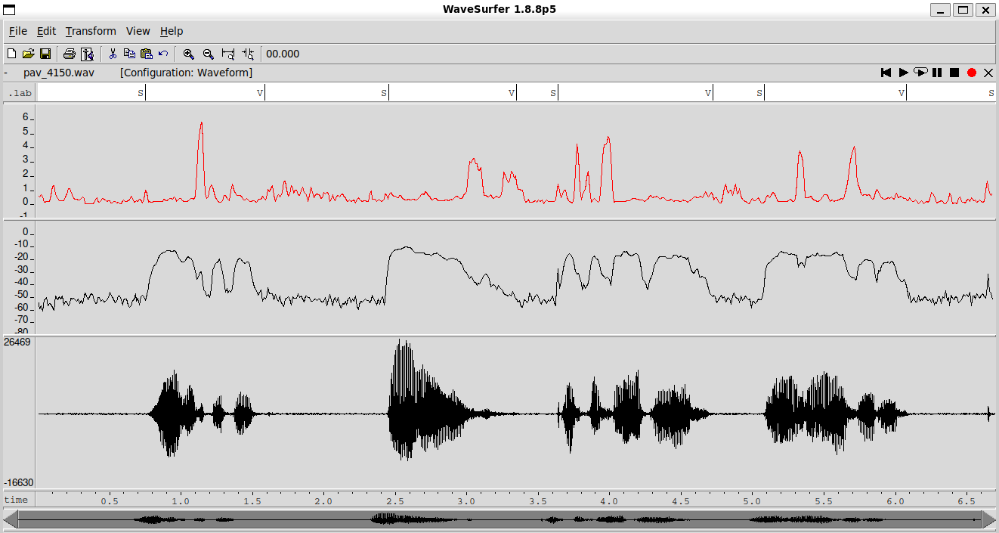
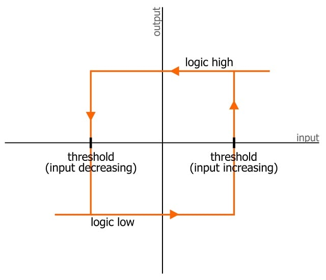
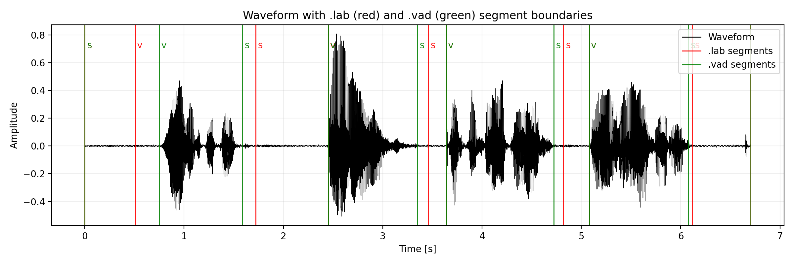
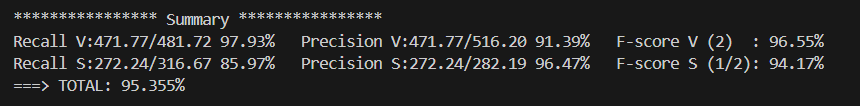
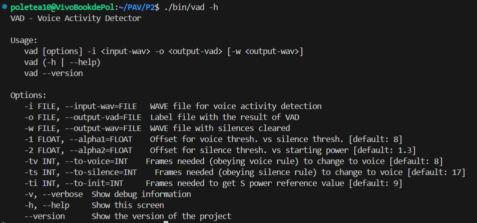

PAV - P2: detección de actividad vocal (VAD)
============================================

Lluis Estape Cusi & Pol Galvez Casasus
--------------------------------------

### RECORDATORIO PARA ENTREGAR LA PRÁCTICA

*	Al final de la práctica, la rama **fulano-mengano** del repositorio GitHub servirá para remitir la
	práctica para su evaluación utilizando el mecanismo *pull request*.
	-	Vaya a la página principal de la copia del repositorio y asegúrese de estar en la rama
		**fulano-mengano**.
	-	Pulse en el botón **New pull request**, y siga las instrucciones de GitHub.

### COMANDOS IMPORTANTES

`docopt_c/docopt_c.py src/vad.docopt -o src/vad_docopt.h` -> Actualizar docopt (argumentos de entrada y mensaje de ayuda)

`meson bin; ninja -C bin` -> Compilar código (en ./bin/vad)

`./bin/vad -i prueba.wav -o prueba.lab` -> Ejecuta el programa sobre un archivo .wav y obtén el output en un .lab

`scripts/run_vad.sh` -> Ejecuta el Test vad

Ejercicios
----------

### Etiquetado manual de los segmentos de voz y silencio

- Etiquete manualmente los segmentos de voz y silencio del fichero grabado al efecto. Inserte, a 
  continuación, una captura de `wavesurfer` en la que se vea con claridad la señal temporal, el contorno de
  potencia y la tasa de cruces por cero, junto con el etiquetado manual de los segmentos.

La señal temporal se ha mostrado con el panel "Waveform".

La potencia (__negro__) y la tasa de cruces por cero (__rojo__) se han obtenido con el programa ./p1 de la práctica anterior (medidas guardadas en _pav_4150.txt_) y mostrado con el panel "Data Plot".

La transcripción (guardada en _pav_4150.vad_) se ha creado y mostrado con el panel "Transcription".

- A la vista de la gráfica, indique qué valores considera adecuados para las magnitudes siguientes:

	* Incremento del nivel potencia en dB, respecto al nivel correspondiente al silencio inicial, para
	  estar seguros de que un segmento de señal se corresponde con voz.

	Si tomamos como referencia el valor medio del silencio durante los primeros 500ms (aprox. -50 dB), podemos decir que el __incremento de nivel para estar seguros de que hay voz ha de ser de unos 10dB__ (V>-40dB, y el silencio no parece llegar nunca a ese nivel)

	* Duración mínima razonable de los segmentos de voz y silencio.

	Hay picos de potencia que no son voz (mirar final de la señal, segundo 6.6). Para no marcarlos como voz, podemos considerar que la __duración mínima de los segmentos de voz es de 150ms__ (p.ej. decir una letra rápido).

	Para el silencio también pasa algo parecido: mientras hablamos hacemos mini pausas (con potencia muy baja, como en el segundo 1.3) que no deben considerarse como silencio. Viendo nuestra señal, podemos considerar que la __duración mínima de los segmentos de silencio ha de ser de unos 400ms__ (p.ej. pausa entre frases).

	Ambos tiempos se han obtenido a ojo a partir de la captura anterior, y a parte de manera intuitiva. Sus valores óptimos se obtendrán más tarde probándolos como argumentos de nuestro programa (archivo _som-hi.sh_)

	* ¿Es capaz de sacar alguna conclusión a partir de la evolución de la tasa de cruces por cero?

	Esta medida __no parece ayudarnos mucho__ para la obtención de los segmentos de Voz y Silencio, aunque parece ser una buena manera de detectar las partes de voz con poca potencia (p.ej. segundo 4).

### Desarrollo del detector de actividad vocal

- Complete el código de los ficheros de la práctica para implementar un detector de actividad vocal en
  tiempo real tan exacto como sea posible. Tome como objetivo la maximización de la puntuación-F `TOTAL`.

Se ha intentado optimizar al máximo nuestro algoritmo para detectar actividad vocal usando los siguientes métodos:

-> __Umbrales de histéresis__ (V -> S : potencia < p_ref + alpha2 | S -> V : potencia > p_ref + alpha2 + alpha1)

-> Valor de referencia (__p_ref__) a partir de __inicialización con varios frames__

-> __Tiempo mínimo de segmento__ para considerar finalmente un cambio de estado

-> Siempre considerar __estado final como silencio__ (si estamos en ST_UNDEF pasamos siempre a ST_SILENCE)

-> __Optimización de valores__ _alpha1, alpha2, to_voice, to_silence, to_init_ con un fichero .sh (_som-hi.sh_)

En el código se pueden ver comentarios explicando cómo se ha implementado cada método.

- Inserte una gráfica en la que se vea con claridad la señal temporal, el etiquetado manual y la detección
  automática conseguida para el fichero grabado al efecto. 

En este gráfico (hecho con matplotlib) se puede ver con claridad la diferencia entre el etiquetado manual (__verde__ -> archivo .vad) y la detección automática (__rojo__ -> archivo .lab).

Las etiquetas de los _timestamps_, a diferencia de waversurfer, se han añadido al inicio de cada segmento (más fácil de leer).

- Explique, si existen. las discrepancias entre el etiquetado manual y la detección automática.

La discrepancia más consistente es la que se ve al final de cada segmento de voz: __nuestro algoritmo acostumbra a detectar silencio un poco más tarde__ de lo que debería, alargando los segmentos de voz. Esto tampoco supone un problema a la práctica, ya que preferimos esto antes de cortar la voz antes de tiempo.

Por lo que hace a la detección de voz, podemos ver que en general coinciden las etiquetas (se solapan en casi todos los segmentos de voz) pero __en el primer segmento estamos detectando la voz un poco antes de lo que deberíamos__. Como hemos dicho antes, no nos supone un gran problema al preferir esto antes de cortar segmentos de voz.

- Evalúe los resultados sobre la base de datos `db.v4` con el script `vad_evaluation.pl` e inserte a 
  continuación las tasas de sensibilidad (*recall*) y precisión para el conjunto de la base de datos (sólo
  el resumen).

### Trabajos de ampliación

#### Cancelación del ruido en los segmentos de silencio

- Si ha desarrollado el algoritmo para la cancelación de los segmentos de silencio, inserte una gráfica en
  la que se vea con claridad la señal antes y después de la cancelación (puede que `wavesurfer` no sea la
  mejor opción para esto, ya que no es capaz de visualizar varias señales al mismo tiempo).

... (Lluis! Està marcat com a TODO en el codi de main_vad.c tot el que has de fer. Treu el TODO quan tot funcioni bé, i comenta les línies de codi que vegis importants)

#### Gestión de las opciones del programa usando `docopt_c`

- Si ha usado `docopt_c` para realizar la gestión de las opciones y argumentos del programa `vad`, inserte
  una captura de pantalla en la que se vea el mensaje de ayuda del programa.

### Contribuciones adicionales y/o comentarios acerca de la práctica

- Indique a continuación si ha realizado algún tipo de aportación suplementaria (algoritmos de detección o 
  parámetros alternativos, etc.).

Todos los métodos usados para la detección de Voz y Silencio se han comentado arriba. Nos basamos en lo que se ha comentado en la práctica y el hecho de que los audios siempre empiezan y acaban en silencio.

- Si lo desea, puede realizar también algún comentario acerca de la realización de la práctica que
  considere de interés de cara a su evaluación.

Se ha intentado usar el "zero-crossing rate" para ayudar a detectar el silencio pero los resultados no eran óptimos. Por eso hemos borrado su código correspondiente.

### Antes de entregar la práctica

Recuerde comprobar que el repositorio cuenta con los códigos correctos y en condiciones de ser 
correctamente compilados con la orden `meson bin; ninja -C bin`. El programa generado (`bin/vad`) será
el usado, sin más opciones, para realizar la evaluación *ciega* del sistema.
